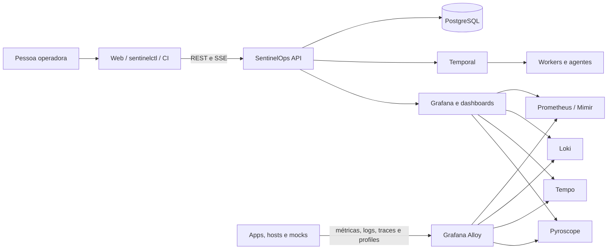

# SentinelOps

[](https://github.com/tharlesson-platform/SentinelOps/actions/workflows/ci.yml)
[](https://github.com/tharlesson-platform/SentinelOps/actions/workflows/release.yml)
[](LICENSE)

Plataforma self-hosted de observabilidade, testes sintéticos e garantia de
delivery. O SentinelOps combina um Control Plane próprio com OpenTelemetry e o
stack Grafana, mantendo gates determinísticos e evidências auditáveis.

> Estado: **local com HA de processo, imagens imutáveis e pipeline provado;
> produção externa condicionada ao alvo**. O caminho Linux é executável com
> mTLS; Helm é o control plane HA e depende de backends/IdP externos
> homologados. Consulte [Limitações reais](#limitações-reais).

## Comece aqui

Escolha somente um caminho:

| Objetivo | Caminho recomendado | Resultado |
|---|---|---|
| Conhecer a ferramenta no computador | `make local-demo` | Plataforma, três apps mock, tráfego e telemetria ponta a ponta |
| Instalar tudo em um servidor Linux vazio | `sudo ./bootstrap-linux.sh` | Perfil single-node com serviço do sistema e validação automática |
| Monitorar outro servidor Linux | `scripts/create-linux-collector-bundle.sh` | Collector mTLS sem transportar a chave da CA |
| Instrumentar uma aplicação | `make bootstrap-apm LANGUAGE=<runtime>` | Kit inicial de OpenTelemetry para o runtime escolhido |
| Preparar produção Kubernetes | Helm + GitOps | Control plane HA dependente dos backends e do IdP reais |

Se esta é sua primeira vez, siga o guia [do zero aos primeiros dados](docs/user-guide/first-30-minutes.md).
O [portal de documentação](docs/README.md) organiza os guias por perfil e objetivo.

## O que funciona

- API Go versionada, PostgreSQL/migrations, JWT local, RBAC e audit events.
- Service Catalog, agentes com bootstrap/heartbeat, cenários versionados e SSE.
- Workflows Temporal com sintético HTTP, PromQL, LogQL, SLO e TraceQL
  fail-closed (PASS/FAIL/INCONCLUSIVE).
- `sentinelctl` para login, contexts, doctor, serviços, cenários, releases,
  validações e agentes, com saída human/JSON/YAML e códigos de saída de CI.
- UI React pt-BR/en-US, dark/light, Catálogo, Test Studio, Delivery Assurance,
  Agent Fleet e conteúdo didático.
- Prometheus, Loki, Tempo, Pyroscope, Grafana, Alloy corrigido, Blackbox e
  MinIO reais; gateway TLS/mTLS com identidade SPIFFE por organização.
- Ecossistema mock instrumentado (`storefront → orders → payments`) com tráfego
  contínuo, métricas via Alloy, logs/traces OTLP, pprof/profiles e falhas
  controladas; Playwright, k6 e prova E2E correlacionada.
- 35 dashboards Grafana gerenciados, alertas de self-monitoring e drill-down de
  metric/exemplar → trace → logs → profile configurado.
- Helm hardened, External Secrets/Argo CD, Terraform para storage/PostgreSQL e
  exemplos de GitHub, GitLab, Jenkins, Azure DevOps, CodePipeline e Rollouts.
- PostgreSQL com role de runtime não-superusuária, FORCE RLS em 41 tabelas e
  migração isolada em Job pré-rollout.

## Arquitetura

Consulte [overview](docs/architecture/overview.md),
[versões](docs/architecture/component-versions.md),
[ADRs](docs/architecture/decisions/) e
[threat model](docs/security/threat-model.md).



O fluxo completo de instalação, onboarding, ingestão, validação de releases e
promoção GitOps está em [fluxos do sistema](docs/architecture/system-flows.md).

## Pré-requisitos

- Docker Desktop com Compose 5.3+ e pelo menos 8 GiB disponíveis.
- `make`, `openssl`, `htpasswd`, `curl` e `jq`.
- macOS Apple Silicon, Linux arm64 ou Linux amd64.

## Instalação Linux do zero

Para instalar tudo em um servidor Linux vazio, com runtime, PKI, migrações,
aplicações mock e prova funcional:

    sudo ./bootstrap-linux.sh

Guia completo: [bootstrap Linux do zero](docs/installation/bootstrap-zero-to-running.md).

## Quickstart

```bash
make local-demo
```

Esse alvo gera os secrets locais, constrói e trava todas as imagens próprias
pelos respectivos IDs SHA256, inicia duas réplicas de API e worker, cadastra os
três mocks e executa as provas fail-closed de telemetria e failover de API.
Para repetir somente a validação sem reconstruir o ambiente:

```bash
make prove-local
```

A saída contém um `trace_id` único e grava evidência JSON com permissão `0600`
em `artifacts/local-e2e/`. A prova exige os três serviços em Prometheus, Loki,
Tempo, Pyroscope e Catálogo, além dos resultados esperados dos quality gates.
`make prove-ha` interrompe uma réplica de API, mede a convergência, executa 50
probes e restaura as duas réplicas. `make prove-resilience` reinicia o
Pyroscope com volume retido e valida seu orçamento de startup.

`make bootstrap` gera secrets e a senha local em `.env` com modo `0600` sem
imprimir o valor; para recuperá-la conscientemente:

```bash
make credentials
```

Não copie `.env` para CI, commits, tickets ou documentação.

## Servidor Linux e onboarding

Para um servidor Linux single-node, execute o bootstrap faseado em vez de
copiar comandos isolados:

```bash
./scripts/install-linux-server.sh --phase preflight
./scripts/install-linux-server.sh --phase runtime --install-runtime  # opcional
./scripts/install-linux-server.sh --phase all --enable-service
```

O instalador suporta hosts com `apt`, `dnf`, `microdnf`, `yum`, `zypper`, `apk` ou
`pacman`, além de qualquer distribuição que já possua Docker Engine e Compose
v2. Ele mantém Web e ingestão em loopback por padrão. Consulte:

- [instalação Linux faseada](docs/installation/linux-server.md);
- [entrega e ativação](docs/operations/delivery-runbook.md);
- [onboarding de servidores](docs/integrations/host-monitoring.md);
- [bootstrap APM](docs/integrations/apm-onboarding.md);
- [estado real da documentação](docs/operations/documentation-status.md).
- [evidência dos novos bootstraps](docs/validation/2026-08-20-linux-bootstrap-evidence.md).

Exemplo de collector para um host Linux monitorado:

```bash
./scripts/install-linux-collector.sh --phase all \
  --host-name srv-app-01 --environment PRD --team plataforma \
  --location dc-sp-01 \
  --metrics-endpoint https://ingest.example.net:8443/api/v1/write \
  --logs-endpoint https://ingest.example.net:8443/loki/api/v1/push \
  --otlp-endpoint https://ingest.example.net:8443 \
  --tls-ca-file /etc/sentinelops/ca.crt \
  --tls-cert-file /etc/sentinelops/client.crt \
  --tls-key-file /etc/sentinelops/client.key \
  --tls-server-name ingest.example.net \
  --enable-service
```

Exemplo de geração do kit de instrumentação:

```bash
make bootstrap-apm LANGUAGE=spring SERVICE=pedidos-api ENVIRONMENT=staging
```

## URLs e portas locais

| Serviço | URL | Exposição |
|---|---|---|
| SentinelOps Web | <http://localhost:3000> | loopback |
| SentinelOps API/OpenAPI | <http://localhost:8080> | loopback |
| Grafana | <http://localhost:3001> | loopback |
| Temporal UI | <http://localhost:8088> | loopback |
| Keycloak | <http://localhost:8081> | loopback |
| Mailpit | <http://localhost:8025> | loopback |
| MinIO API/Console | <http://localhost:9000>, <http://localhost:9001> | loopback |
| Prometheus | <http://localhost:9090> | loopback |
| Loki | <http://localhost:3100> | loopback |
| Tempo | <http://localhost:3200> | loopback |
| Pyroscope | <http://localhost:4040> | loopback |
| Alloy | <http://localhost:12345> | loopback |
| Demo Storefront | <http://localhost:8090/api/checkout> | loopback |
| OTLP gRPC/HTTP | `4317`, `4318` | loopback |

## Operação local

```bash
make up              # build e start idempotente
make local-demo      # instala, carrega mocks e prova todo o pipeline
make down            # para, preservando volumes
make reset           # remove somente volumes do projeto local
make seed             # registra demo e cenário HTTP
make test             # Go race tests, web tests e build
make test-synthetics  # Playwright e k6 reais
make logs             # logs agregados do Compose
make doctor           # health/readiness ponta a ponta
make prove-local      # prova métricas, logs, traces, perfis e gates
make prove-ha         # prova failover e restauração das réplicas locais
make prove-resilience # prova cold start/readiness do Pyroscope
make validate-release # Helm HA, actionlint, digest e assinatura local
```

## CLI

Build sem instalar Go localmente:

```bash
docker build -f Dockerfile.app --build-arg APP=cli -t sentinelctl:0.1.0 .
docker run --rm --network host -e SENTINEL_API_URL=http://localhost:8080 \
  -e SENTINEL_PASSWORD='<senha local>' sentinelctl:0.1.0 login
```

Em hosts com Go:

```bash
go run ./apps/cli --output json doctor
SENTINEL_PASSWORD='<senha>' go run ./apps/cli login
go run ./apps/cli service list
go run ./apps/cli scenario apply -f examples/scenarios/demo-health.json
```

Códigos: `0` sucesso, `2` gate FAIL, `3` erro de execução, `4`
INCONCLUSIVE e `5` autenticação/autorização.

## Registrar uma aplicação

1. Instrumente a aplicação com OTLP para `http://alloy:4318` ou gRPC `4317`.
2. Use os atributos mínimos: `service.name`, `service.version`,
   `deployment.environment.name`, `team` e `owner`.
3. Normalize rotas e nunca use `user_id`, email, token, request/trace ID como
   label métrica.
4. Registre o catálogo:

```bash
sentinelctl service apply -f service.yaml
```

5. Confirme recebimento no Grafana, crie SLO/cenário e associe uma política de
   release antes de usar o gate em PRD.

## Validar um deployment

```bash
sentinelctl release register \
  --service sentinel-demo-api --environment development \
  --version 1.0.0 --commit-sha "$GIT_SHA" --image-digest "$IMAGE_DIGEST"

sentinelctl release validate --release-id "$RELEASE_ID" --mode standard
sentinelctl validation wait "$VALIDATION_ID"
```

Exemplos completos estão em [examples/integrations](examples/integrations/).
O rollback automático é desabilitado; qualquer adapter exige política,
escopo, auditoria, dry-run e aprovação explícita.

## Falhas controladas da demo

Somente os mocks aceitam `?fault=latency|timeout|error|cpu|exception` ou o
header `X-Demo-Fault`. Use `fault_service=storefront|orders|payments` para
aplicar a falha em apenas um salto. Não há operações destrutivas. Exemplos:

```bash
curl 'http://localhost:8090/api/checkout?fault=latency&fault_service=orders'
curl -H 'X-Demo-Fault: error' \
  'http://localhost:8090/api/checkout?fault_service=payments'
```

## Produção

- Use `deploy/helm/sentinelops`, `values-small-production.yaml` ou
  `values-distributed-production.yaml`; publique imagens por digest após scan,
  SBOM e assinatura.
- Use OIDC, TLS/mTLS, External Secrets, PostgreSQL/Temporal/object storage HA,
  backups testados e NetworkPolicies ajustadas ao cluster real.
- Rode `helm lint/template` e `terraform plan`; **não** use Compose em produção.
- Loki produtivo grande deve usar microservices; Mimir substitui Prometheus.
- Consulte [produção](docs/operations/production.md),
  [isolamento PostgreSQL](docs/operations/database-tenancy.md),
  [release assinada](docs/operations/release-process.md),
  [Terraform faseado](infra/terraform/README.md),
  [backup/restore/upgrade](docs/operations/lifecycle.md) e
  [runbooks](docs/runbooks/operational-response.md).
- O bootstrap Linux é um perfil single-node para laboratório/piloto; não é o
  perfil `small-production`. As duas réplicas toleram falha de processo, mas
  permanecem no mesmo host e não comprovam falha física, DR ou IdP externo.

## Limitações reais

- A API implementa descoberta OIDC/JWKS e resolve organização; privilégios vêm
  de `role_bindings`, não do role claim. Federação Entra ID/Keycloak, MFA,
  grupos e provisionamento de bindings ainda exigem homologação no IdP real.
- Worker executa HTTP sintético periódico; execução distribuída browser/k6 via
  fila de agentes, importadores cURL/OpenAPI/Postman/HAR, plugins AMQP/Kafka/DB,
  flaky detection e cache offline ainda não estão implementados.
- Gates HTTP, PromQL, LogQL, TraceQL e SLO são executáveis; baseline estatística
  adaptativa e políticas de infraestrutura adicionais permanecem backlog.
- Dashboard Studio próprio, incident management, capacity/correlation agents,
  RUM/Faro e assistant read-only permanecem backlog.
- Helm não instala os backends de observabilidade; opere charts oficiais
  versionados por perfil. Terraform inclui storage/RDS, não provisiona ainda
  EKS/AKS, Mimir/Loki/Tempo/Pyroscope/Temporal HA nem DR multi-região.
- Evidência local não substitui CI terminal verde no SHA, imagens publicadas e
  assinadas, admission policy, branch protegida e rollout no cluster alvo.
- O Compose é single-node e os backends locais usam modo single-tenant. O
  gateway remoto é mTLS/tenant-bound, mas evidência local não equivale a HA,
  storage multi-tenant ou aprovação produtiva.

## Estrutura do repositório

```text
.
├── apps/                  # API, worker, web, CLI e utilitários
├── dashboards/            # dashboards Grafana gerenciados
├── demo/                   # ecossistema mock instrumentado
├── deploy/                 # Compose, Helm, Argo CD, gateway e observabilidade
├── docs/                   # arquitetura, instalação, operação e segurança
├── examples/               # cenários, serviços e integrações CI/CD
├── infra/terraform/        # fundação de dados por ambiente
├── internal/               # domínio e implementação Go
├── scripts/                # bootstrap, provas e operação segura
└── tests/                  # testes browser, carga e integração
```

## Governança e suporte

- Mudanças entram por Pull Request e passam pelos checks definidos em `.github/workflows`.
- Vulnerabilidades devem seguir [SECURITY.md](SECURITY.md), nunca uma issue pública.
- Convenções de contribuição estão em [CONTRIBUTING.md](CONTRIBUTING.md).
- Papéis, decisões e promoção estão em [GOVERNANCE.md](GOVERNANCE.md).
- Estado comprovado e lacunas externas estão em
  [cobertura da documentação](docs/operations/documentation-status.md).

## Licenças

Código próprio: MIT. Consulte [LICENSE](LICENSE),
[THIRD_PARTY_LICENSES.md](THIRD_PARTY_LICENSES.md),
[component versions](docs/architecture/component-versions.md) e gere SBOM no CI.
