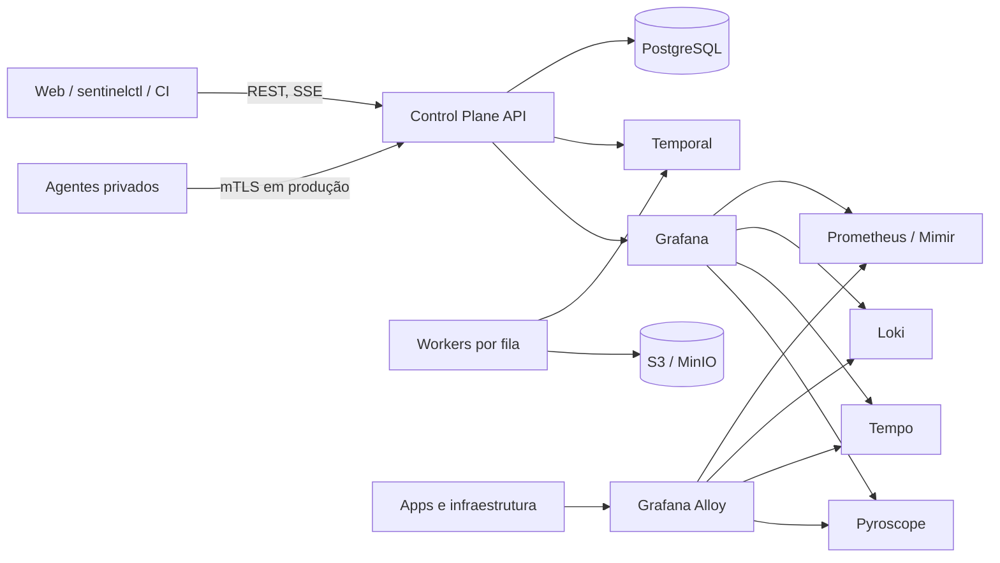
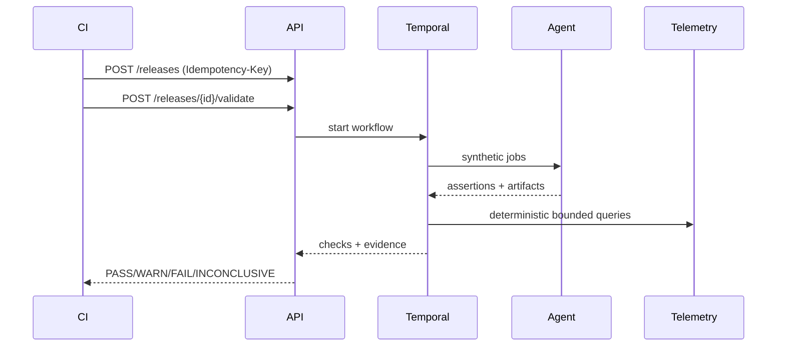

# Arquitetura do SentinelOps

SentinelOps separa o **Control Plane**, que armazena intenção, agenda jobs e
avalia políticas, do **Data Plane**, que coleta e consulta telemetria.

## Control Plane

- Go, API REST em `/api/v1`, OpenAPI 3.1 e SSE.
- PostgreSQL com isolamento lógico por `organization_id`, constraints e
  auditoria append-only.
- Temporal para workflows duráveis. Redis não é dependência obrigatória.
- Política determinística versionada para gates.
- Autenticação local somente em desenvolvimento; OIDC é a opção de produção.

## Data Plane

- OTLP gRPC/HTTP é o contrato de transporte.
- Alloy recebe, remove atributos sensíveis, aplica limites e encaminha sinais.
- `local-demo`: Prometheus, Loki monolítico, Tempo monolítico e Pyroscope.
- Produção distribuída: Mimir, Loki microservices, Tempo e Pyroscope com object
  storage. Simple Scalable Loki não é tratado como arquitetura final.

## Fluxo de validação

## Limites de confiança

Agentes nunca recebem shell arbitrário. Secrets são referências resolvidas no
ambiente de execução. Logs, traces, uploads e respostas externas são conteúdo
não confiável. Assistentes opcionais só geram consultas allowlisted e nunca
alteram o resultado do gate.

