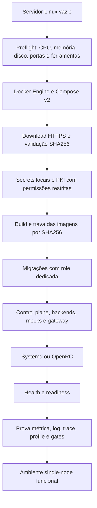
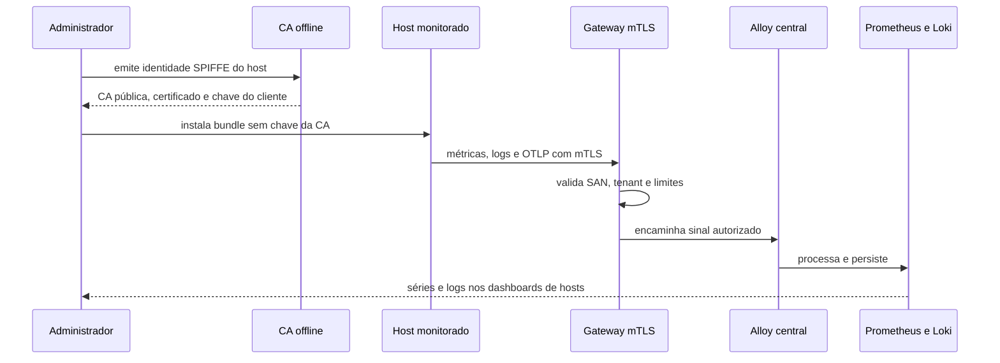
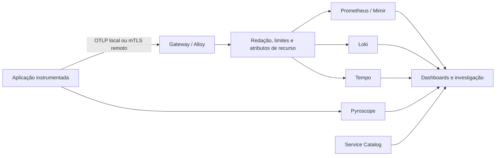
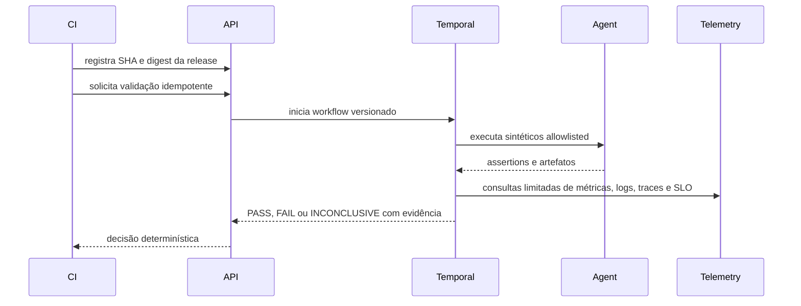

# Fluxos do sistema

Os diagramas abaixo mostram responsabilidades e limites entre instalação,
coleta, processamento, consulta e promoção. A documentação é a referência; o
estado vivo deve sempre ser comprovado no ambiente alvo.

## Instalação do zero em Linux

## Coleta de um servidor Linux

## APM de uma aplicação

Os atributos mínimos são `service.name`, `service.version`,
`deployment.environment.name`, `team` e `owner`. Dados pessoais, tokens e IDs
de alta cardinalidade não podem ser labels métricas.

## Validação de uma release

## Promoção para produção

```mermaid
flowchart LR
  Change[Branch de mudança] --> PR[Pull Request]
  PR --> CI[Tests, lint, scan, SBOM e manifests]
  CI --> Review[CODEOWNERS e aprovação]
  Review --> Main[Merge em main protegida]
  Main --> Release[Imagem multiarch por digest e assinatura OIDC]
  Release --> GitOps[Atualização declarativa no repositório GitOps]
  GitOps --> Argo[Argo CD reconcilia]
  Argo --> Cluster[Cluster alvo]
  Cluster --> Runtime[Readiness, SLO, restore e rollback]
```

A CI valida e publica; ela não deve aplicar produção de forma imperativa. O
cluster só é aprovado depois que políticas, IdP, backends, dados, restore e
rollback forem comprovados no alvo real.
